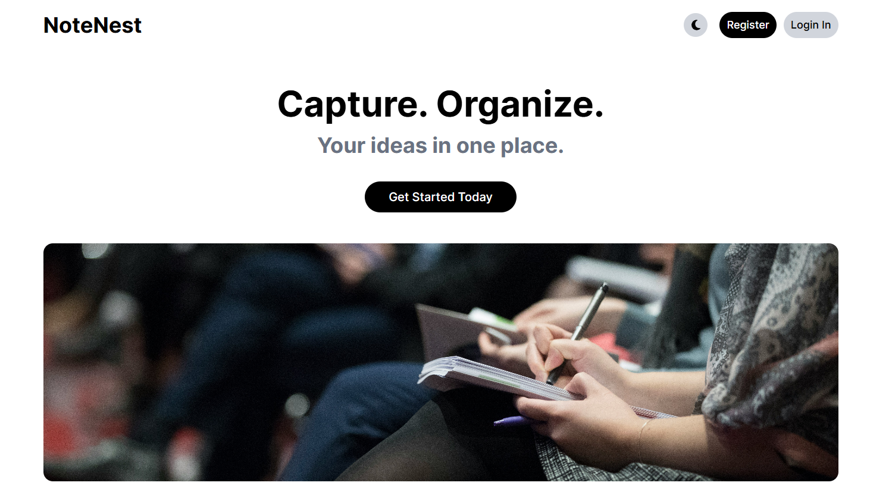

# NoteNest

**NoteNest** is a sleek and secure full-stack web application designed for managing personal notes. It provides a seamless experience for users to create, organise, and securely store their thoughts, tasks, and ideas. With a focus on clean design and privacy-first architecture, NoteNest empowers users to manage their digital notes effortlessly and securely.

You can view the [live site here](https://terenceclzhang-notenest.netlify.app/).

_Note: The backend is hosted on Render's free tier, which may take 50 seconds or more to wake up when idle. Please be patient on the first request._

## Features

- **Secure User Authentication** - Robust custom authentication system using bcrypt for password hashing and JSON Web Tokens (JWT) for secure session management.
- **CRUD for Notes** - Users can create, view, edit, and delete personal notes through a responsive and intuitive interface.
- **User-Specific Data Access** - Each user can access only their own notes. All note-related operations are securely scoped to the authenticated user.
- **Search Functionality** – Quickly find notes with a built-in search feature for efficient navigation

## Tech Stack

- **Frontend**:
  - [React](https://react.dev/) - UI library
  - [TypeScript](https://www.typescriptlang.org/) - Type-safe JavaScript
  - [Tailwind CSS](https://tailwindcss.com/) - CSS framework
  - [Axios](https://axios-http.com/) - HTTP client
  - [Redux](https://redux.js.org/) - Global state management
  - [React Hook Forms](https://react-hook-form.com/) - Form state management
  - [React Router](https://reactrouter.com/) - Single Page Application (SPA) routing
  - [Font Awesome](https://fontawesome.com/) -Icon library
- **Backend**:
  - [Node.js](https://nodejs.org/) - JavaScript runtime environment
  - [Express.js](https://expressjs.com/) - Node.js Web framework
  - [cors](https://www.npmjs.com/package/cors) - Cross-origin requests
  - [bcrypt](https://www.npmjs.com/package/bcrypt) - Password hashing
  - [jsonwebtoken](https://www.npmjs.com/package/jsonwebtoken) - JWT authentication
  - [cookie-parser](https://www.npmjs.com/package/cookie-parser) - Cookie handling
  - [morgan](https://www.npmjs.com/package/morgan) - Request logging
- **Backend**:
  - [MongoDB](https://www.mongodb.com/) - NoSQL database
  - [mongoose](https://mongoosejs.com/) - MongoDB Object Data Modeling (ODM) library

## Contributions

This is a personal project created to showcase my skills. I am not accepting contributions at this time. However, I am open to suggestions, which you can make via the [Disucssions tab](https://github.com/TerenceCLZhang/notenest/discussions).

## License

This project is released under the [MIT License](LICENSE). You are free to use, modify, and distribute this project in accordance with the terms of the license.
